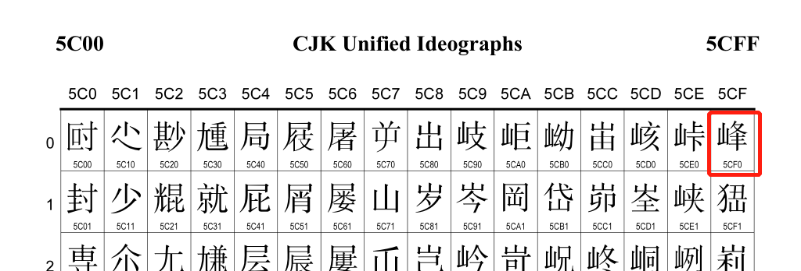

# Table of Contents

* [编程基础](#编程基础)
  * [字长](#字长)
  * [机器数](#机器数)
  * [真值](#真值)
  * [源码、反码、补码](#源码、反码、补码)
  * [位、字节、字符的区别](#位、字节、字符的区别)
* [语法知识](#语法知识)
  * [数据类型](#数据类型)
    * [byte](#byte)
  * [位运算](#位运算)
    * [与运算](#与运算)
    * [或运算](#或运算)
    * [非运算](#非运算)
    * [异或运算](#异或运算)
    * [移位运算](#移位运算)
  * [进制转换](#进制转换)
    * [10进制转16进制](#10进制转16进制)
    * [16进制转10进制](#16进制转10进制)
    * [10进制转2进制](#10进制转2进制)
    * [2进制转10进制](#2进制转10进制)
  * [类型转换](#类型转换)
    * [byte转int](#byte转int)
* [字符编码](#字符编码)
  * [ASCII码](#ascii码)
  * [Unicode](#unicode)
  * [UTF-8](#utf-8)
* [IO流](#io流)
  * [流的分类](#流的分类)
  * [从File类开始](#从file类开始)
  * [节点流](#节点流)
    * [节点流的分类](#节点流的分类)
    * [FileInputStream和FileOutputStream](#fileinputstream和fileoutputstream)
    * [FileReader和FileWriter](#filereader和filewriter)
    * [ByteArrayInputStream和ByteArrayOutputStream](#bytearrayinputstream和bytearrayoutputstream)
  * [处理流](#处理流)
    * [处理流的类型](#处理流的类型)
    * [过滤流——FilterInputStream和FilterOutputStream](#过滤流filterinputstream和filteroutputstream)
    * [过滤流——FilterReader和FilterWriter](#过滤流filterreader和filterwriter)
    * [缓冲流——BufferedReader和BufferedWriter](#缓冲流bufferedreader和bufferedwriter)
    * [缓冲流——BufferedInputStream和BufferedOutputStream](#缓冲流bufferedinputstream和bufferedoutputstream)
    * [转换流——InputStreamReader和OutputStreamWriter](#转换流inputstreamreader和outputstreamwriter)
    * [数据流DataInputStream和DataOutputStream](#数据流datainputstream和dataoutputstream)
    * [Print流](#print流)
    * [Object流](#object流)
* [网络编程](#网络编程)
* [多线程](#多线程)
* [附录](#附录)
  * [引入Log4J](#引入log4j)
  * [引入Junit](#引入junit)


# 编程基础


# 语法知识
## 数据类型
Java语言提供了八种基本类型。六种数字类型（四个整数型，两个浮点型），一种字符类型，还有一种布尔型。具体类型为byte、short、int、long、float、
double、boolean、char。

### byte
Java提供了一个byte数据类型，并且是基本类型。Java byte是做为最小的数字来处理的，因此它的值域被定义为-128~127，也就是signed byte。下面这主要
给大家介绍了关于java中byte类型的相关知识。

byte，即字节，由8位的二进制组成。在Java中，byte类型的数据是8位带符号的二进制数。在计算机中，8位带符号二进制数的取值范围是[-128, 127]，
所以在Java中，byte类型的取值范围也是[-128, 127]。

```java
public static void basicInfo(){
    logger.info("Byte类型最大值" + Byte.MAX_VALUE);
    logger.info("Byte类型最小值" + Byte.MIN_VALUE);
}
```
打印结果：

```text
Byte类型最大值127
Byte类型最小值-128
```

以上代码说明byte类型最大支持128，最小-127，但是不能大于128或小于-127，否则编译阶段都过不去，在定义byte类型数据的时候可以使用10进制或者16进制都
可以，例如：
```java
public static void definedByteTypeData() {
    // 定义十进制的byte值
    byte a = 1;
    byte b = -8;
    logger.info("a=" + a + " b=" + b);

    // 也可以用16进制表示，十六进制0x65对应十进制数为101
    byte c = 0x65;
    logger.info("c=" + c);

    byte d = 101;
    logger.info("d=" + d);
}
```

下面我们看一下字节型数据转16进制数据


## 进制转换
众所周知，计算机底层采用二进制计算，为了解决减法的问题引入了补码。我们在编程的时候大多是用十进制数字，有时候还设计到一些十六进制的数字，本章节的把各
种进制的转换讲清楚。

### 10进制转16进制
```java
public static String decimalismToHexadecimal(int i) {
    String str = Integer.toHexString(i);
    return str;
}
```

测试类如下：
```java
/**
 * A~F表示10~15
 * be 11*16 + 14 = 190
 */
@Test
public void testDecimalismToHexadecimal() {
    int i=190;
    String str = HexBinDecOct.decimalismToHexadecimal(i);
    System.out.println(str);
}
```
上面的程序我们将十进制int类型的数据转换成16进制。我们使用到了Integer.toHexString(int i)方法，现在我想将byte类型的十进制数据转换成十六进制数
据，理想状态下JDK API应该给我们提供一个Integer.toHexString(byte bytes)类型的方法，事实上并没有如我们所愿，JDK API中没有这个方法，先说结论，
再详细分析，下面程序将byte类型的十进制数据转换为十六进制数:

```java
/**
 * 字节型数据转十六进制数据
 * @param b 需要进行转换的byte字节
 * @return  转换后的Hex字符串
 */
public static String byteToHex(byte b){
    String hex = Integer.toHexString(b & 0xFF);
    if(hex.length() < 2){
        hex = "0" + hex;
    }
    return hex;
}
```
测试类如下：
```java
@Test
public void testByteToHex() {
    byte a = 101;
    System.out.println( ByteType.byteToHex(a));
}
```
运行测试类，控制台输出十六进制的字符串“65”
```text
十六进制[65] = [6×16 + 5] = 十进制[101]
```
在代码String hex = Integer.toHexString(b & 0xFF)中，Integer类的toHexString(int i)方法本身接收的是一个int类型的参数，所以问题的关键是
如何将byte类型的数据转化为int类型的数据才是关键。byte转int请参考 [byte转int](#类型转换)章节中的byte转int部分。

### 16进制转10进制
```java
public static int hexadecimalToDecimalism(String str) {
    int i = Integer.parseInt(str,16);
    return i;
}
```

测试类如下：
```java
@Test
public void testHexadecimalToDecimalism() {
    String str = "5CF0";
    int i = HexBinDecOct.hexadecimalToDecimalism(str);
    System.out.println(i + "Unicode码对应的汉字是" + (char)i);
}
```

打印结果：
```text
23792对应的汉字是峰
```
该示例将十六进制字符串“5CF0”转化成十进制，再转化成字符“峰”，字符窜“5CF0”是在Unicode编码表查询到的。



### 10进制转2进制
```java
public static String decimalismToBinary(int i) {
    String str = Integer.toBinaryString(i);
    return str;
}
```

测试类如下：

```java
/**
 * 190=2+4+8+16+32+128
 */
@Test
public void testDecimalismToBinary() {
    int i=190;
    String str = HexBinDecOct.decimalismToBinary(i);
    System.out.println(str);
}
```
控制台打印结果是
```text
10111110
```
这里需要注意的是，int类型的数据转化成二进制打印的结果并不是32位长度，而是根据数字的大小灵活调整长度。

### 2进制转10进制

```java
public static int binaryToDecimalism(String str) {
    int i = Integer.parseInt(str,2);
    return i;
}
```

测试类如下：

```java
/**
 * 00000111 = 1+2+4 = 7
 */
@Test
public void testBinaryToDecimalism() {
    String str = "00000111";
    int i = HexBinDecOct.binaryToDecimalism(str);
    System.out.println(i);
    Assert.assertThat(i, Is.is(7));
}
```

## 类型转换
  ### byte转int
   java中byte转换为 int有两种情况，一种是要求保持值不变，例如进行数值计算，可采用强制类型转换：int i = (int) aByte;
   另一种是要求保持最低字节中各个位不变，3个高字节全部用0填充，例如进行编解码操作，
   则需要采用位操作：int i = b & 0xff;下面编写程序演示一下：

```java
public static int byteToInt(byte b) {
    return (int)b;
}
```
测试类如下：
```java
@Test
public void testByteToInt() {
    byte b = 120;
    System.out.println("转化后的十进制数字为 : " 
            + ByteType.byteToInt(b));
}
```
控制台打印结果如下：
```text
转化后的十进制数字为 : 120
```

int InputStream.read()
该函数返回一个int类型，范围从0至255，如果到达流末尾，返回-1。通过ByteArrayInputStream的源码可以看到是如何从byte转到int
public synchronized int read() {
return (pos < count) ? (buf[pos++] & 0xff) : -1;
}

对于一个单一的byte转int就是其本身,因为byte范围是-128--127如果输入超过这个数直接编译不通过
byte i=12;
int c=(int)i;
c=12;

像前面一部分,int转byte后得到的是一个4字节的byte[]数组,因为int长度就是4字节,不管值有多大或是0 byte[]也是4个长度,里面的值都是0;
继续上面的最终byte[]数组中的结果是
byte[] b ={0,0,4,-34};从下标0-4存的是int类型的高位到低位的顺序
|------高16位-----------| |---------低16位--------|
00000000 00000000 00000100 11011110
|   0         | |   0         | |   4         | |  -34        |
int 到byte是向右移动,那转换回来就是反其道而行之

# 字符编码
字符编码一直是很多Java程序员的一个噩梦，字符编码是计算机技术的重要基石，所以我单独写一个章节把这件事讲清楚。

## ASCII码
我们知道，计算机内部，所有信息最终都是一个二进制值。每一个二进制位（bit）有0和1两种状态，因此八个二进制位就可以组合出256种状态，(2的8次方)
这被称为一个字节（byte）。也就是说，一个字节一共可以用来表示256种不同的状态，每一个状态对应一个符号，就是256个符号，从00000000到11111111。

上个世纪60年代，美国制定了一套字符编码，对英语字符与二进制位之间的关系，做了统一规定。这被称为 ASCII 码，一直沿用至今。

ASCII 码一共规定了128个字符的编码，比如空格SPACE是32（二进制00100000），大写的字母A是65（二进制01000001）。这128个符号（包括32个不能打印出
来的控制符号），只占用了一个字节的后面7位，最前面的一位统一规定为0。

* 非ASCII编码
英语用128个符号编码就够了，但是用来表示其他语言，128个符号是不够的。比如，在法语中，字母上方有注音符号，它就无法用 ASCII 码表示。于是，一些欧洲国
家就决定，利用字节中闲置的最高位编入新的符号。比如，法语中的é的编码为130（二进制10000010）。这样一来，这些欧洲国家使用的编码体系，可以表示最多
256个符号。

但是，这里又出现了新的问题。不同的国家有不同的字母，因此，哪怕它们都使用256个符号的编码方式，代表的字母却不一样。比如，130在法语编码中代表了é，在
希伯来语编码中却代表了字母Gimel (ג)，在俄语编码中又会代表另一个符号。但是不管怎样，所有这些编码方式中，0--127表示的符号是一样的，不一样的只是
128--255的这一段。

至于亚洲国家的文字，使用的符号就更多了，汉字就多达10万左右。一个字节只能表示256种符号，肯定是不够的，就必须使用多个字节表达一个符号。比如，简体中文
常见的编码方式是 GB2312，使用两个字节表示一个汉字，所以理论上最多可以表示 256 x 256 = 65536 个符号。

中文编码的问题需要专文讨论，这篇笔记不涉及。这里只指出，虽然都是用多个字节表示一个符号，但是GB类的汉字编码与后文的 Unicode 和 UTF-8 是毫无关系的
。

## Unicode
正如上一节所说，世界上存在着多种编码方式，同一个二进制数字可以被解释成不同的符号。因此，要想打开一个文本文件，就必须知道它的编码方式，否则用错误的
编码方式解读，就会出现乱码。为什么电子邮件常常出现乱码？就是因为发信人和收信人使用的编码方式不一样。

可以想象，如果有一种编码，将世界上所有的符号都纳入其中。每一个符号都给予一个独一无二的编码，那么乱码问题就会消失。这就是 Unicode，就像它的名字都
表示的，这是一种所有符号的编码。

Unicode 当然是一个很大的集合，现在的规模可以容纳100多万个符号。每个符号的编码都不一样，比如，U+0639表示阿拉伯字母Ain，U+0041表示英语的大写字母
A，U+4E25表示汉字严。具体的符号对应表，可以查询unicode.org，或者专门的汉字对应表。

下面程序将Unicode转成汉字
```java
public static void unicodeToChineseChar(String str) {
		
    String [] chars = str.split(" ");
    
    for(int i=0;i<chars.length;i++) { 
        
        System.out.println(chars[i]+" | "+(char)Integer.parseInt(chars[i],16));
        
    } 
 }
```

测试类如下：

```java
@Test
public void testUnicodeToChineseChar() {
    String str = "5723 8BDE 5FEB 4E50";
    UnicodeConvert.unicodeToChineseChar(str);
}
```
Unicode码5723 8BDE 5FEB 4E50分别对应汉字”圣诞快乐“四个字,打印结果如下：

```text
5723 | 圣
8BDE | 诞
5FEB | 快
4E50 | 乐
```

那么汉字如何转成Unicode码呢？


* Unicode 的问题
需要注意的是，Unicode 只是一个符号集，它只规定了符号的二进制代码，却没有规定这个二进制代码应该如何存储。

比如，汉字严的 Unicode 是十六进制数4E25，转换成二进制数足足有15位（100111000100101），也就是说，这个符号的表示至少需要2个字节。表示其他更大的
符号，可能需要3个字节或者4个字节，甚至更多。

这里就有两个严重的问题，第一个问题是，如何才能区别 Unicode 和 ASCII ？计算机怎么知道三个字节表示一个符号，而不是分别表示三个符号呢？第二个问题是
，我们已经知道，英文字母只用一个字节表示就够了，如果 Unicode 统一规定，每个符号用三个或四个字节表示，那么每个英文字母前都必然有二到三个字节是0，
这对于存储来说是极大的浪费，文本文件的大小会因此大出二三倍，这是无法接受的。

它们造成的结果是：

1）出现了 Unicode 的多种存储方式，也就是说有许多种不同的二进制格式，可以用来表示 Unicode。

2）Unicode 在很长一段时间内无法推广，直到互联网的出现。

## UTF-8
互联网的普及，强烈要求出现一种统一的编码方式。UTF-8 就是在互联网上使用最广的一种 Unicode 的实现方式。其他实现方式还包括 UTF-16（字符用两个字节
或四个字节表示）和 UTF-32（字符用四个字节表示），不过在互联网上基本不用。重复一遍，这里的关系是，UTF-8 是 Unicode 的实现方式之一。

UTF-8 最大的一个特点，就是它是一种变长的编码方式。它可以使用1~4个字节表示一个符号，根据不同的符号而变化字节长度。

UTF-8 的编码规则很简单，只有二条：

1）对于单字节的符号，字节的第一位设为0，后面7位为这个符号的 Unicode 码。因此对于英语字母，UTF-8 编码和 ASCII 码是相同的。

2）对于n字节的符号（n > 1），第一个字节的前n位都设为1，第n + 1位设为0，后面字节的前两位一律设为10。剩下的没有提及的二进制位，全部为这个符号的 
Unicode 码。

下表总结了编码规则，字母x表示可用编码的位。

Unicode符号范围 (十六进制) | UTF-8编码方式（二进制）
-|-
0000 0000-0000 007F | 0xxxxxxx |
0000 0080-0000 07FF | 110xxxxx 10xxxxxx |
0000 0800-0000 FFFF | 1110xxxx 10xxxxxx 10xxxxxx |
0001 0000-0010 FFFF | 11110xxx 10xxxxxx 10xxxxxx 10xxxxxx |

跟据上表，解读 UTF-8 编码非常简单。如果一个字节的第一位是0，则这个字节单独就是一个字符；如果第一位是1，则连续有多少个1，就表示当前字符占用多少个
字节。下面，还是以汉字严为例，演示如何实现 UTF-8 编码。严的 Unicode 是4E25（100111000100101），根据上表，可以发现4E25处在第三行的范围内
（0000 0800 - 0000 FFFF），因此严的 UTF-8 编码需要三个字节，即格式是1110xxxx 10xxxxxx 10xxxxxx。然后，从严的最后一个二进制位开始，
依次从后向前填入格式中的x，多出的位补0。这样就得到了，严的 UTF-8 编码是11100100 10111000 10100101，转换成十六进制就是E4B8A5。


# 网络编程

# 多线程

# 附录

## 引入Log4J

此处引入的是最传统的log4J技术，没有使用slf4j

* 修改pom文件，引入log4j的jar包
```xml
<dependency>
    <groupId>log4j</groupId>
    <artifactId>log4j</artifactId>
    <version>1.2.17</version>
</dependency>
```
* 在resources文件夹创建log4j.properties

```properties
设置级别：
log4j.rootLogger=debug,appender1,appender2
输出到控制台
log4j.appender.appender1=org.apache.log4j.ConsoleAppender
样式为TTCCLayout   
log4j.appender.appender1.layout=org.apache.log4j.TTCCLayout

输出到文件(这里默认为追加方式)
log4j.appender.appender2=org.apache.log4j.FileAppender
设置文件输出路径
【1】文本文件
log4j.appender.appender2.File=logs/app.log
设置文件输出样式
log4j.appender.appender2.layout=org.apache.log4j.TTCCLayout
```
* 在Java类中创建logger
```java
private static Logger logger = Logger.getLogger(FileReaderDemo.class);
```
FileReaderDemo是当前类的名字

* 使用的时候直接按照自己想要的级别打印就可以了
```java
logger.info("the file path is " + filePath);
```

## 引入Junit

* 在pom文件中增加junit和hamcrest依赖
```xml
<dependency>
    <groupId>junit</groupId>
    <artifactId>junit</artifactId>
    <version>4.12</version>
</dependency>

<dependency>
    <groupId>org.hamcrest</groupId>
    <artifactId>hamcrest-core</artifactId>
    <version>1.3</version>
</dependency>
```
* 引入之后直接在代码里使用即可,例如
```java
public class CreateFileTest {

    @Test
    public void testCreateFile() {
        int i = new CreateFile().createFile();
        assertThat(i, is(0));
    }
}
```
